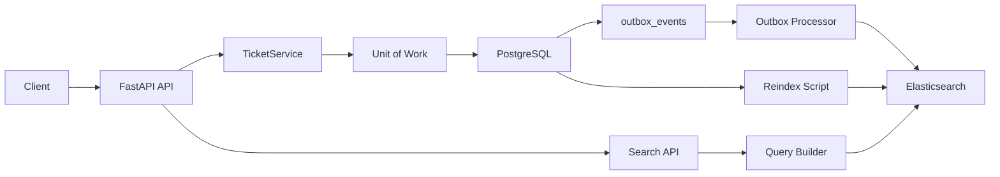

# FastAPI Ticket Search Service

[](https://github.com/melika-kheirieh/fastapi-ticket-search-service/actions/workflows/ci.yml)

A production-aware backend learning project for managing support tickets with PostgreSQL and searching them with Elasticsearch.

The core design idea is simple:

**PostgreSQL is the source of truth. Elasticsearch is a query-optimized search projection.**

This project is not just an Elasticsearch demo. It is a backend service that demonstrates persistence, migrations, API design, search query construction, controlled search failure handling, outbox-backed indexing, retryable processing, reindexing, tests, CI, and Docker-based verification.

## Features

* FastAPI REST API
* PostgreSQL persistence
* SQLAlchemy model, repository, service, and Unit of Work layers
* Alembic migrations
* Ticket CRUD endpoints
* Filtering and pagination
* Elasticsearch explicit index mapping
* Full-text ticket search
* Isolated Elasticsearch query builder
* Controlled `503 Service Unavailable` response for search backend failures
* Outbox-backed Elasticsearch synchronization
* Retry handling for failed outbox events
* Recovery for stuck `processing` outbox events
* Manual outbox processor runner
* Reindex flow from PostgreSQL to Elasticsearch
* Unit/API tests with pytest
* Docker Compose local stack
* End-to-end search smoke script
* GitHub Actions CI with fast tests and Docker smoke verification

## Tech Stack

* Python 3.12
* FastAPI
* Pydantic
* SQLAlchemy
* Alembic
* PostgreSQL
* Elasticsearch
* Docker Compose
* pytest
* GitHub Actions

## Architecture



Application boundaries:

```text
Write path:
API Router -> TicketService -> Unit of Work -> TicketRepository + OutboxEventRepository -> PostgreSQL

Search sync path:
Outbox Processor -> outbox_events -> PostgreSQL ticket state -> Elasticsearch

Search path:
Search API -> Query Builder -> Elasticsearch

Repair path:
Reindex Script -> PostgreSQL -> Elasticsearch
```

PostgreSQL owns the durable ticket state. Elasticsearch stores a derived search document that can be rebuilt from PostgreSQL if the search index becomes stale or unavailable.

Ticket writes do not update Elasticsearch directly from the service layer. Instead, ticket changes create outbox events in the same database transaction. A separate outbox processor reads those events and synchronizes the Elasticsearch projection.

## API Overview

| Method   | Endpoint               | Purpose                                  |
| -------- | ---------------------- | ---------------------------------------- |
| `GET`    | `/health`              | Health check                             |
| `POST`   | `/tickets`             | Create a ticket                          |
| `GET`    | `/tickets`             | List tickets with filters and pagination |
| `GET`    | `/tickets/{ticket_id}` | Get one ticket                           |
| `PATCH`  | `/tickets/{ticket_id}` | Update a ticket                          |
| `DELETE` | `/tickets/{ticket_id}` | Delete a ticket                          |
| `GET`    | `/tickets/search`      | Search tickets with Elasticsearch        |

## Ticket Fields

A ticket contains:

* `id`
* `user_id`
* `title`
* `description`
* `status`
* `priority`
* `category`
* `tags`
* `created_at`
* `updated_at`

## Search Behavior

The search endpoint supports full-text search and exact filters.

Supported query parameters include:

| Parameter      | Purpose                                              |
| -------------- | ---------------------------------------------------- |
| `q`            | Full-text search across ticket title and description |
| `user_id`      | Filter by ticket owner                               |
| `status`       | Filter by ticket status                              |
| `priority`     | Filter by priority                                   |
| `category`     | Filter by category                                   |
| `tag`          | Filter by one tag                                    |
| `created_from` | Filter tickets created at or after this timestamp    |
| `created_to`   | Filter tickets created at or before this timestamp   |
| `limit`        | Limit result count                                   |
| `offset`       | Skip result count for pagination                     |

Example:

```bash
curl "http://localhost:8001/tickets/search?q=payment&status=open&tag=checkout&limit=10&offset=0"
```

### Search Failure Behavior

Search results and search availability are handled as separate cases.

| Scenario                              | Response                     |
| ------------------------------------- | ---------------------------- |
| Search succeeds with matching tickets | `200 OK` with ticket results |
| Search succeeds with no matches       | `200 OK` with `[]`           |
| Invalid search parameters             | `422 Unprocessable Entity`   |
| Search backend is unavailable         | `503 Service Unavailable`    |

The search endpoint does not return an empty list when Elasticsearch is unavailable, because that would incorrectly imply that the search completed successfully with no matches.

## Outbox-backed Elasticsearch Sync

PostgreSQL is the source of truth in this project. Elasticsearch is used as a search projection, not as the primary data store.

Earlier versions of the service updated Elasticsearch directly from `TicketService` after ticket create/update/delete operations. That approach was simple, but it had a reliability gap: the database transaction could succeed while Elasticsearch indexing failed, leaving only a log message and no durable recovery signal.

The current design uses an outbox table.

When a ticket is created, updated, or deleted, the service writes both the ticket change and an outbox event in the same PostgreSQL transaction:

* `ticket.created`
* `ticket.updated`
* `ticket.deleted`

A separate outbox processor reads processable events and syncs Elasticsearch.

This keeps the application service focused on the main use case and moves search projection synchronization into a separate component.

### Outbox Event Lifecycle

Outbox events can move through these statuses:

* `pending`
* `processing`
* `processed`
* `failed`

The processor supports:

* processing new `pending` events;
* retrying `failed` events up to a configurable retry limit;
* recovering stuck `processing` events after a timeout.

This means an Elasticsearch failure does not silently lose the sync signal. The event remains in PostgreSQL with `retry_count`, `last_error`, `processed_at`, `created_at`, and `updated_at` fields for debugging and recovery.

### Processing Outbox Events Manually

For local development, process outbox events with:

```bash
./scripts/process_outbox_events.sh --limit 20 --max-retry-count 3 --processing-timeout-seconds 300
```

This command processes:

* new `pending` events;
* retryable `failed` events;
* stuck `processing` events older than the configured timeout.

The Docker-based smoke flow also uses the outbox processor:

```bash
./scripts/verify_search_flow.sh
```

That smoke script verifies the full outbox-backed search flow:

```text
create ticket -> outbox event -> processor -> Elasticsearch -> search result
update ticket -> outbox event -> processor -> Elasticsearch -> updated result
delete ticket -> outbox event -> processor -> Elasticsearch -> removed result
```

### Intentional Scope

The current processor is a simple single-run processor, not a distributed worker system.

The project intentionally does not introduce Celery, Redis-backed workers, multi-worker locking, or `FOR UPDATE SKIP LOCKED` yet. Those would be natural next steps, but the current implementation focuses on the core reliability boundary first:

* durable event creation;
* transaction-safe ticket and outbox writes;
* retryable processing;
* stuck event recovery;
* testable processor behavior.

## Local Development

Create and activate a virtual environment:

```bash
python -m venv .venv
source .venv/bin/activate
```

Install dependencies:

```bash
python -m pip install --upgrade pip
python -m pip install -r requirements.txt
```

Run tests:

```bash
pytest -q
```

Run the API locally without Docker:

```bash
uvicorn app.main:app --reload
```

Health check:

```bash
curl http://localhost:8000/health
```

## Docker Compose

Build and start the full local stack:

```bash
docker compose up --build -d
```

Check service status:

```bash
docker compose ps -a
```

The API is available at:

```text
http://localhost:8001
```

OpenAPI docs:

```text
http://localhost:8001/docs
```

Stop the stack:

```bash
docker compose down
```

Remove local volumes when you need a clean reset:

```bash
docker compose down -v
```

Use `down -v` carefully in local development because it removes PostgreSQL and Elasticsearch volumes.

## Database Migrations

Run migrations inside the API container:

```bash
docker compose exec api alembic upgrade head
```

Check the current migration revision:

```bash
docker compose exec api alembic current
```

Create a new migration after model changes:

```bash
docker compose exec api alembic revision --autogenerate -m "describe change"
```

## Elasticsearch Setup

Create the Elasticsearch ticket index:

```bash
docker compose exec api python -m app.search.setup
```

Reindex tickets from PostgreSQL into Elasticsearch:

```bash
docker compose exec api python -m app.search.reindex
```

The reindex flow exists because Elasticsearch is treated as a rebuildable projection, not as the primary database.

## Smoke Tests

Run the ticket API smoke script:

```bash
bash scripts/verify_ticket_api.sh
```

Run the end-to-end outbox-backed search smoke script:

```bash
bash scripts/verify_search_flow.sh
```

The search smoke script verifies the main search flow from outside the application:

* the API is reachable;
* Elasticsearch is reachable from the API container;
* the Elasticsearch index exists;
* a ticket can be created through the API;
* the created ticket is synced into the search projection through the outbox processor;
* the ticket can be found through the search endpoint;
* the ticket can be updated through the API;
* the updated ticket is synced through the outbox processor;
* the updated ticket can be found through the search endpoint;
* the ticket can be deleted through the API;
* the delete event is processed through the outbox processor;
* the deleted ticket is removed from the search projection.

By default, smoke scripts target:

```text
http://localhost:8001
```

You can override the target API URL when needed:

```bash
BASE_URL=http://localhost:8000 bash scripts/verify_search_flow.sh
```

## Testing

Run the test suite:

```bash
pytest -q
```

Current test coverage focuses on:

* ticket CRUD API behavior;
* service/repository boundaries;
* Unit of Work transaction boundary;
* ticket + outbox event creation in the same transaction;
* rollback behavior when outbox event creation fails;
* request validation;
* filtering and pagination;
* Elasticsearch mapping;
* Elasticsearch document conversion;
* Elasticsearch query building;
* search API behavior with fake search clients;
* controlled search backend failure handling;
* outbox event lifecycle;
* outbox processor behavior;
* failed event retry behavior;
* stuck `processing` event recovery;
* reindex behavior.

The fast test suite is designed to run without a live PostgreSQL or Elasticsearch service.

## CI

GitHub Actions runs two validation jobs on pushes to `main` and on pull requests.

The `tests` job installs dependencies and runs the fast pytest suite.

The `docker-smoke` job runs after `tests`, starts the Docker Compose stack, executes the search smoke flow, prints Docker logs on failure, and tears the stack down.

This keeps fast feedback separate from the heavier end-to-end check.

## Design Decisions

### PostgreSQL is the source of truth

Ticket data is stored and updated in PostgreSQL. Elasticsearch is not treated as the primary database.

### Elasticsearch is a search projection

Search documents are derived from ticket records. If Elasticsearch becomes stale, the index can be rebuilt from PostgreSQL.

### Ticket writes create durable outbox events

Ticket create/update/delete operations create outbox events in the same PostgreSQL transaction as the ticket change.

This avoids the failure gap where the database write succeeds but the external search sync fails without a durable retry signal.

### Service layer does not know Elasticsearch indexing details

`TicketService` coordinates the application use case and writes outbox events. It does not create Elasticsearch clients, build Elasticsearch documents, or call indexing functions directly.

Search projection synchronization belongs to the outbox processor.

### Repositories do not commit transactions

Repositories add, update, delete, and query objects, but they do not commit transactions.

The Unit of Work owns commit, rollback, and refresh behavior for use cases that involve multiple repositories.

### Search failures are explicit

The search API treats Elasticsearch failures as search subsystem failures. If Elasticsearch is unavailable, `/tickets/search` returns `503 Service Unavailable` instead of returning a misleading empty result set.

The search layer translates backend-specific failures into an internal `SearchUnavailableError`, and the API layer maps that error to an HTTP response.

### Query building is isolated

Elasticsearch query construction lives in a separate module so search behavior can be tested without running Elasticsearch.

### Reindexing is explicit

The project includes a reindex command to rebuild the search projection from PostgreSQL. This makes the source-of-truth boundary visible and recoverable.

### Fast tests and smoke tests are separated

Fast tests run with pytest and focus on unit/API behavior. Smoke tests run against the Docker Compose stack and verify the main runtime flow.

## Out of Scope

This project does not currently include:

* authentication or authorization;
* Redis/Celery-based async workers;
* multi-worker outbox locking;
* production-grade distributed outbox processing;
* advanced observability;
* production Elasticsearch cluster configuration;
* cloud deployment;
* semantic or hybrid search.

## Roadmap

Planned next steps:

* add structured logging and lightweight observability;
* add request IDs and better operational logs around outbox processing;
* add Redis/Celery for async worker execution;
* add multi-worker-safe outbox claiming;
* add PostgreSQL full-text search comparison;
* add semantic or hybrid search with embeddings;
* add Persian search quality improvements.
