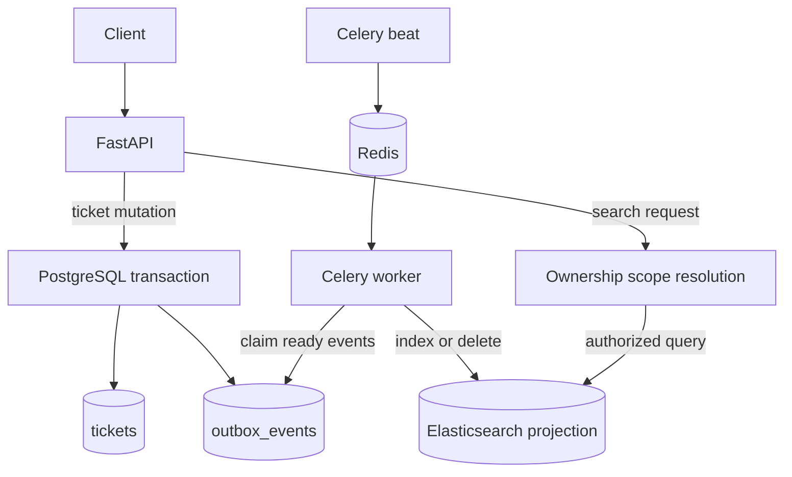

# FastAPI Ticket Search Service

[](https://github.com/melika-kheirieh/fastapi-ticket-search-service/actions/workflows/ci.yml)


A production-aware backend service for managing support tickets in PostgreSQL and making them searchable through an Elasticsearch projection.

**PostgreSQL is the durable source of truth. Elasticsearch is a rebuildable, query-optimized search projection.**

## Key Capabilities

* FastAPI ticket CRUD and search APIs with Pydantic request and response schemas
* PostgreSQL persistence with SQLAlchemy repositories and Alembic migrations
* Elasticsearch search projection with explicit index setup and query construction
* Transactional outbox synchronization with retry metadata and stuck-event recovery
* Celery worker and beat scheduler with Redis as broker and result backend
* Ownership authorization across PostgreSQL-backed CRUD and Elasticsearch-backed search
* Search ownership resolved before Elasticsearch query execution
* Request IDs, structured JSON API logging, and Prometheus-compatible metrics
* Non-root application containers in Docker Compose
* Comprehensive pytest coverage and GitHub Actions CI
* Docker smoke verification for end-to-end runtime behavior

## Architecture

Ticket mutations commit the ticket row and outbox event in one PostgreSQL transaction. Celery beat schedules processing tasks through Redis, while the Celery worker claims durable events from PostgreSQL and updates Elasticsearch asynchronously.

Search requests pass through the FastAPI authorization boundary before Elasticsearch is queried.



PostgreSQL holds durable ticket state. Elasticsearch is eventually consistent and can be rebuilt from PostgreSQL.

Detailed design notes are available in [docs/architecture.md](docs/architecture.md). Elasticsearch mapping and query construction live in [`app/search/mappings.py`](app/search/mappings.py) and [`app/search/queries.py`](app/search/queries.py).

## Quick Start

Start the full local stack:

```bash
docker compose up --build -d
```

Run the integrated smoke verification:

```bash
scripts/verify_search_flow.sh
```

The API is available at:

```text
http://localhost:8001
```

Interactive API documentation is available at:

```text
http://localhost:8001/docs
```

To stop the stack and remove local data volumes:

```bash
docker compose down -v
```

For local Python setup, migrations, configuration, logs, health checks, and troubleshooting, see [docs/operations.md](docs/operations.md).

## Demo and Verification

The Docker smoke script, [`scripts/verify_search_flow.sh`](scripts/verify_search_flow.sh), verifies the integrated runtime path:

1. PostgreSQL, Redis, Elasticsearch, API, Celery worker, and Celery beat become available.
2. API, worker, and beat run as the non-root `app` user.
3. HTTP and outbox metrics are exposed at `/metrics`.
4. An authenticated ticket is created through the API.
5. The corresponding outbox event is processed by the Celery worker.
6. The ticket document is indexed in Elasticsearch.
7. The owner can find the ticket through `/tickets/search`.

### pytest

The project currently has **91 passing pytest tests** covering:

* API behavior and validation
* authentication context and authorization
* database filtering and pagination
* Elasticsearch mapping and query construction
* indexing, deletion, and reindexing
* transactional outbox writes and processing
* retry scheduling and stuck-event recovery
* metrics, health checks, and request IDs
* Celery configuration and task behavior

GitHub Actions runs the pytest suite on pushes to `main` and on pull requests.

### Docker smoke

After pytest succeeds, GitHub Actions starts the Docker Compose stack and runs the smoke script as a separate integration job.

This keeps unit and API verification distinct from containerized runtime verification.

## API Overview

| Method   | Path                   | Purpose                                             |
| -------- | ---------------------- | --------------------------------------------------- |
| `POST`   | `/tickets`             | Create a ticket                                     |
| `GET`    | `/tickets`             | List tickets with PostgreSQL filters and pagination |
| `GET`    | `/tickets/search`      | Search tickets through Elasticsearch                |
| `GET`    | `/tickets/{ticket_id}` | Retrieve one ticket                                 |
| `PATCH`  | `/tickets/{ticket_id}` | Update a ticket                                     |
| `DELETE` | `/tickets/{ticket_id}` | Delete a ticket                                     |
| `GET`    | `/health`              | Check API liveness                                  |
| `GET`    | `/health/search`       | Check Elasticsearch reachability                    |
| `GET`    | `/metrics`             | Expose Prometheus-compatible metrics                |

Create a ticket as user `1`:

```bash
curl -X POST "http://localhost:8001/tickets" \
  -H "Content-Type: application/json" \
  -H "X-User-ID: 1" \
  -d '{
    "user_id": 1,
    "title": "Payment failed",
    "description": "Customer payment failed during checkout.",
    "status": "open",
    "priority": "high",
    "category": "billing",
    "tags": ["payment", "checkout"]
  }'
```

Search the current user's visible tickets:

```bash
curl "http://localhost:8001/tickets/search?q=payment&status=open&tag=checkout&limit=10&offset=0" \
  -H "X-User-ID: 1"
```

Filter and query-builder implementation details are in [`app/search/queries.py`](app/search/queries.py). Authorization and consistency behavior are documented in [docs/architecture.md](docs/architecture.md).

## Reliability and Authorization Guarantees

### Reliability

* Ticket mutation and outbox event creation occur in the same PostgreSQL transaction.
* Elasticsearch does not participate in the ticket-write transaction.
* Celery processes durable outbox events asynchronously after commit.
* Failed events retain `retry_count`, `last_error`, and `next_attempt_at`.
* Stale `processing` events can be reclaimed after a configurable timeout.
* Retryable and reclaimed events remain subject to the configured retry limit.
* Elasticsearch can be rebuilt from PostgreSQL through the reindex command.

This design keeps ticket writes independent from Elasticsearch availability while preserving the intent to update the search projection.

### Authorization

Protected ticket endpoints require `X-User-ID`.

`X-User-Role` is optional, defaults to `user`, and supports `user` and `admin`.

* Regular users can create, list, retrieve, update, delete, and search only their own tickets.
* A regular user cannot create a ticket for another `user_id`.
* Direct cross-user resource access returns an ownership-hidden `404`.
* Explicitly requesting another user's list or search scope returns `403`.
* Missing or invalid identity context returns `401`.
* Ownership scope is resolved before the Elasticsearch query is constructed or executed.

Elasticsearch search is therefore not a path around the API authorization boundary.

These headers provide a **demo identity mechanism**, not production authentication. JWT, OAuth/OIDC, password flows, and production identity-provider integration are outside the current scope.

## Observability

The application provides:

* **Request IDs** — an incoming `X-Request-ID` is reused when present; otherwise the API generates one and includes it on completed responses
* **Structured JSON logging** — API logs include operational `event` fields and the active `request_id`
* **`/health`** — API liveness
* **`/health/search`** — Elasticsearch reachability through the application's ping check
* **`/metrics`** — Prometheus-compatible HTTP, search, and outbox instrumentation

Metric families include:

* `http_requests_total`
* `http_request_duration_seconds`
* `search_requests_total`
* `search_unavailable_total`
* `search_request_duration_seconds`
* `outbox_events_by_status`

This repository exposes Prometheus-compatible metrics but does **not** deploy Prometheus, Alertmanager, or Grafana.

Operational commands, metric guidance, logging details, and troubleshooting are documented in [docs/operations.md](docs/operations.md).

## Current Scope Boundaries

The project is intentionally bounded for clarity and reviewability.

It currently does not include:

* production authentication or identity verification
* JWT login or refresh-token flows
* password management
* production identity-provider integration
* Prometheus server, Alertmanager, or Grafana deployment
* PostgreSQL full-text search evaluation
* Persian lexical evaluation or analyzer support
* semantic or hybrid search
* Kubernetes or production deployment infrastructure

Completed milestones and future phases are tracked in [docs/roadmap.md](docs/roadmap.md).

## Documentation

| Document                                     | Purpose                                                                         |
| -------------------------------------------- | ------------------------------------------------------------------------------- |
| [docs/architecture.md](docs/architecture.md) | Runtime boundaries, consistency, authorization, search, failure, and recovery   |
| [docs/operations.md](docs/operations.md)     | Setup, configuration, metrics, smoke verification, logs, and troubleshooting    |
| [docs/roadmap.md](docs/roadmap.md)           | Completed milestones, future search phases, authentication, and deployment work |
