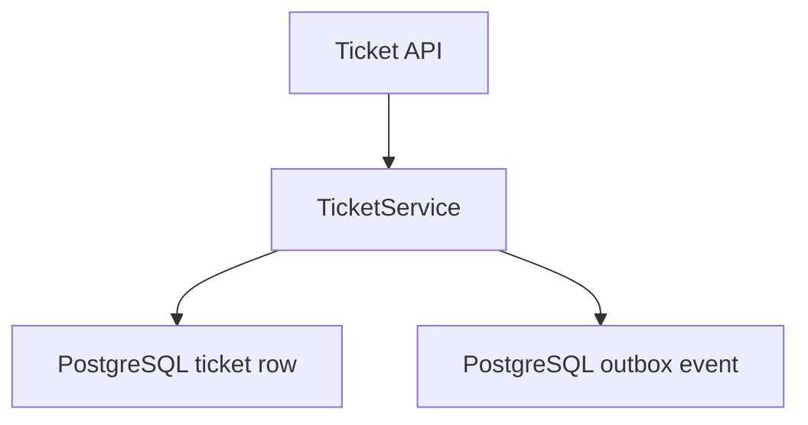
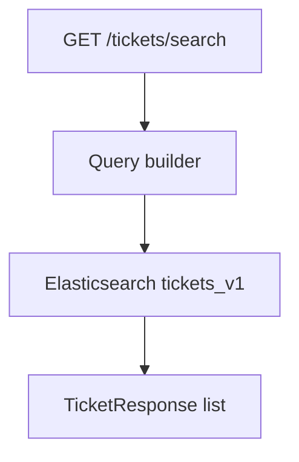
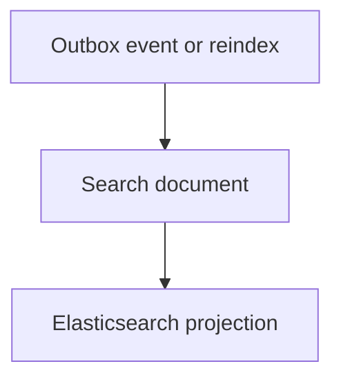

# FastAPI Ticket Search Service

[](https://github.com/melika-kheirieh/fastapi-ticket-search-service/actions/workflows/ci.yml)


A production-aware backend learning project for managing support tickets with PostgreSQL and searching them through an Elasticsearch projection.

**PostgreSQL is the durable source of truth. Elasticsearch is a rebuildable, query-optimized search projection.**

This is not just an Elasticsearch demo. It is a small backend system that shows API design, persistence, migrations, search mapping, query construction, outbox-based indexing, reindexing, tests, Docker Compose verification, and lightweight observability.

## Highlights

- FastAPI REST API for ticket create/read/update/delete
- PostgreSQL persistence with SQLAlchemy repositories and Alembic migrations
- Database-backed filtering and pagination
- Elasticsearch `tickets_v1` index with explicit mapping
- Search endpoint with full-text query, exact filters, tag filter, date range, pagination, and sorting
- Durable outbox events for ticket-to-search synchronization
- Retry metadata for failed indexing events
- Reindex command to rebuild Elasticsearch from PostgreSQL
- Request id middleware and structured JSON logs
- Separate `/health` and `/health/search` endpoints
- Docker Compose stack with PostgreSQL, Elasticsearch, migration, and API services
- pytest coverage and GitHub Actions CI

## Reviewer Guide

If you are reviewing the project quickly, start here:

| Topic | Where to look | What it shows |
| --- | --- | --- |
| Architecture | [docs/architecture.md](docs/architecture.md) | Write path, search path, outbox sync, recovery model |
| Design decisions | [docs/design-decisions.md](docs/design-decisions.md) | Tradeoffs behind PostgreSQL, Elasticsearch, outbox, reindexing, and health checks |
| Operations | [docs/operations.md](docs/operations.md) | How to run, verify, debug, and reset the stack |
| Roadmap | [docs/roadmap.md](docs/roadmap.md) | Completed phases, next steps, intentionally deferred scope |

Important implementation areas:

- [app/services/ticket_service.py](app/services/ticket_service.py): ticket write orchestration
- [app/repositories/outbox_event_repository.py](app/repositories/outbox_event_repository.py): durable outbox state
- [app/services/outbox_processor.py](app/services/outbox_processor.py): projection sync and retry behavior
- [app/search/queries.py](app/search/queries.py): testable Elasticsearch query construction
- [app/search/reindex.py](app/search/reindex.py): projection rebuild from PostgreSQL
- [app/main.py](app/main.py): request ids, health checks, and router wiring

## Project Status

The first three phases are complete:

| Phase | Status | Main outcome |
| --- | --- | --- |
| Phase 1 | Complete | Ticket CRUD API, PostgreSQL persistence, Alembic migrations, filters, pagination, Docker Compose, CI |
| Phase 2 | Complete | Elasticsearch mapping, index setup, outbox events, retryable processor, reindex command, search API |
| Phase 3 | Complete | Request ids, structured JSON logs, search health endpoint, smoke verification script |

Current intentional exclusions:

- Authentication and authorization
- Production deployment setup
- A continuously running background worker container for the outbox processor
- Advanced search features such as Persian analyzers, highlighting, suggestions, or embeddings

## Architecture Summary

The write path commits ticket data and outbox events to PostgreSQL:



The search path reads from Elasticsearch:



The projection can be repaired through retries or rebuilt fully from PostgreSQL:



The consistency model is intentional:

- PostgreSQL writes are strongly consistent inside the database transaction.
- Elasticsearch search is eventually consistent and rebuildable.
- Search outages do not prevent ticket writes.

## API

Health:

```http
GET /health
GET /health/search
```

Tickets:

```http
POST /tickets
GET /tickets
GET /tickets/search
GET /tickets/{ticket_id}
PATCH /tickets/{ticket_id}
DELETE /tickets/{ticket_id}
```

Create a ticket:

```bash
curl -X POST "http://localhost:8001/tickets" \
  -H "Content-Type: application/json" \
  -d '{
    "user_id": 1,
    "title": "Payment failed",
    "description": "Customer payment failed during checkout.",
    "status": "open",
    "priority": "high",
    "category": "billing",
    "tags": ["payment", "checkout"]
  }'
```

List tickets with database filters:

```bash
curl "http://localhost:8001/tickets?status=open&category=billing&limit=10&offset=0"
```

Search tickets through Elasticsearch:

```bash
curl "http://localhost:8001/tickets/search?q=payment&status=open&tag=checkout&limit=10&offset=0"
```

## Search Projection

The Elasticsearch index is named `tickets_v1`.

The mapping lives in [app/search/mappings.py](app/search/mappings.py). Important field choices:

| Field | Type | Purpose |
| --- | --- | --- |
| `title`, `description` | `text` | Full-text search |
| `status`, `priority`, `category`, `tags` | `keyword` | Exact filtering |
| `user_id` | `long` | Owner filter |
| `created_at`, `updated_at` | `date` | Sorting, ranges, freshness |

Ticket writes create durable outbox events:

| API action | Outbox event |
| --- | --- |
| `POST /tickets` | `ticket.created` |
| `PATCH /tickets/{ticket_id}` | `ticket.updated` |
| `DELETE /tickets/{ticket_id}` | `ticket.deleted` |

If search sync fails, the outbox event keeps `retry_count`, `last_error`, and `next_attempt_at`.

Rebuild the full projection from PostgreSQL:

```bash
python -m app.search.reindex
```

## Quick Start

Start the full local stack:

```bash
docker compose up --build -d
```

Create the Elasticsearch ticket index:

```bash
docker compose exec api python -m app.search.setup
```

Check health:

```bash
curl http://localhost:8001/health
curl http://localhost:8001/health/search
```

Run the smoke flow:

```bash
scripts/verify_search_flow.sh
```

Stop the stack:

```bash
docker compose down
```

More commands and troubleshooting notes are in [docs/operations.md](docs/operations.md).

## Local Python Development

```bash
python -m venv .venv
source .venv/bin/activate
python -m pip install --upgrade pip
python -m pip install -r requirements.txt
alembic upgrade head
uvicorn app.main:app --reload
```

Local API health:

```bash
curl http://localhost:8000/health
```

## Tests

Run the test suite:

```bash
pytest -q
```

The tests are focused on unit/API behavior and do not require a live Elasticsearch instance.

Coverage includes:

- ticket API behavior and validation
- database filtering and pagination
- outbox event creation, claiming, retry scheduling, and stuck processing recovery
- Elasticsearch mapping, query building, indexing, and delete behavior
- reindexing from PostgreSQL
- search API forwarding and error handling
- request id middleware, search health states, and JSON log formatting

Run the Docker-based smoke flow after the stack is up:

```bash
scripts/verify_search_flow.sh
```

## Repository Structure

```text
app/
  api/              FastAPI routers
  core/             configuration, logging, request context
  db/               SQLAlchemy base and session
  models/           SQLAlchemy models
  repositories/     database access layer
  schemas/          Pydantic request/response models
  search/           Elasticsearch client, mapping, query, indexer, reindex
  services/         ticket use cases and outbox processing
alembic/            database migrations
docs/               architecture, design decisions, operations, roadmap
scripts/            local verification scripts
tests/              pytest suite
```

## Roadmap

See [docs/roadmap.md](docs/roadmap.md) for the full roadmap.

Nearest follow-up areas:

- wire the outbox processor as a Docker Compose worker service
- add authentication and authorization
- improve search quality with analyzers, highlighting, and suggestions

