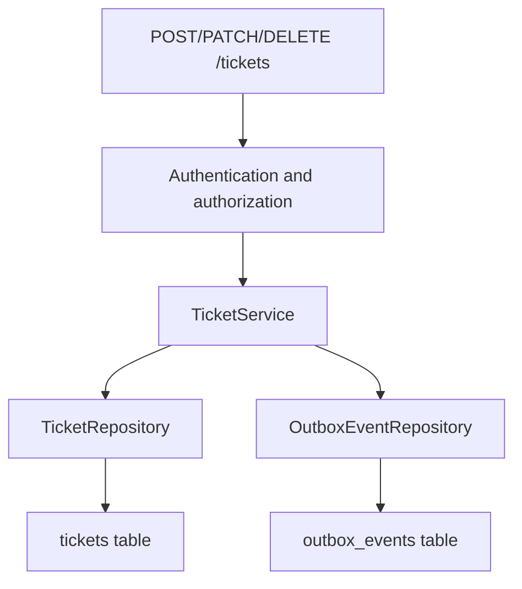
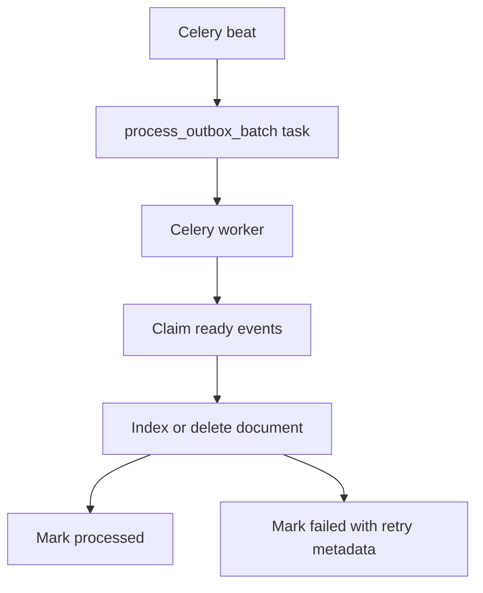
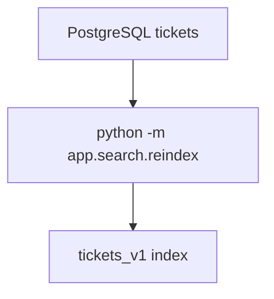
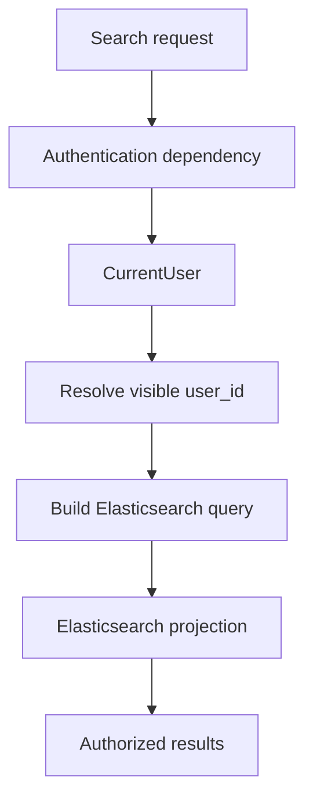
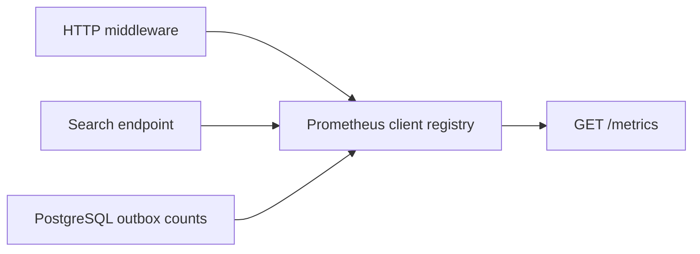

# Architecture Notes

This service is built around one boundary:

**PostgreSQL is the durable source of truth. Elasticsearch hosts an eventually
consistent, rebuildable search projection.**

The API never treats Elasticsearch as the system of record. Search can be temporarily stale, unavailable, or rebuilt without losing ticket data.

## Runtime Boundaries

| Boundary | Responsibility |
| --- | --- |
| FastAPI routes | Validate HTTP input, wire dependencies, enforce route-level access boundaries, and serialize responses |
| Authentication dependency | Validates demo identity headers and constructs a `CurrentUser` |
| Authorization helpers/boundary | Resolves visible ownership scope and hides inaccessible individual resources |
| Service layer | Runs ticket use cases and transaction-level write orchestration after authorization |
| Repositories | Encapsulate PostgreSQL ticket and outbox reads and writes |
| PostgreSQL | Durable source of truth for ticket state and outbox intent |
| Redis | Celery broker and result backend |
| Celery beat | Schedules periodic outbox-processing tasks |
| Celery worker | Executes scheduled outbox-processing tasks |
| Outbox processor | Claims ready events, updates Elasticsearch, and stores processing or retry state |
| Elasticsearch | Eventually consistent, rebuildable full-text search projection |
| Metrics instrumentation | Records HTTP and search counters/histograms and maintains outbox gauges |
| `/metrics` | Reads current outbox counts and exposes the Prometheus client registry |
| Reindex command | Recreates and rebuilds the Elasticsearch projection from PostgreSQL |

## Authentication Context

Every `/tickets` route depends on `get_current_user`. The dependency reads
`X-User-ID` and the optional `X-User-Role`, validates both values, defaults the
role to `user`, and creates a `CurrentUser`. The identifier must be a positive
integer, and the role must be either `user` or `admin`. Missing or invalid
context returns `401` before the ticket domain service runs.

This header mechanism provides demo authentication context so the repository
can exercise authorization behavior. The supplied values are not
cryptographically verified and are not production identity verification. JWT,
OAuth/OIDC, login, password handling, and production identity-provider
integration are not implemented.

## Authorization Model

Regular users are restricted to tickets whose `user_id` matches their current
user. Admins can access tickets across users.

- Create validates payload ownership before calling the ticket service.
- List resolves a regular user's ownership filter before querying PostgreSQL.
- Search resolves ownership before constructing the Elasticsearch query.
- Get, update, and delete load the resource and apply an ownership check before
  returning or mutating it.
- Admin list and search can target one `user_id` or omit it to span users.

| Status | Meaning |
| ------ | ------- |
| `401` | Authentication context is missing or invalid |
| `403` | The authenticated user explicitly requests a forbidden ownership scope |
| `404` | A resource belonging to another user is hidden |

## Write Path

Authorization is checked in the route boundary before a mutation reaches the
ticket service. The service then commits the ticket change and its outbox event
together in one PostgreSQL transaction.

Elasticsearch does not participate in this transaction. The application does
not need Elasticsearch to be healthy in order to accept ticket writes.

## Incremental Search Sync

Celery beat schedules outbox-processing batches, and the Celery worker runs them after the write transaction exists in PostgreSQL.

The processor stores retry state in PostgreSQL:

- `status`
- `retry_count`
- `last_error`
- `next_attempt_at`
- `processed_at`

The processor claims pending events, failed events whose retry time has arrived
and whose retry count remains below the configured limit, and processing events
older than the configured timeout whose retry count also remains below the
limit. Row locking with `SKIP LOCKED` avoids duplicate claims across workers,
while timeout-based reclamation recovers work left stuck by an interrupted
processor. This keeps failure handling visible and testable.

## Full Rebuild

The reindex command is the recovery path for a missing or stale search projection.

Reindexing is useful when:

- the Elasticsearch index is recreated
- the mapping changes
- local development data is reset
- projection state is suspected to be stale

## Search Authorization Boundary

Elasticsearch is a separate projection and must not bypass authorization. The
route resolves the visible `user_id` before query construction: every
regular-user query includes the current user's identifier, while an admin query
may target one user or span users. A regular user who explicitly asks for a
different `user_id` receives `403` before Elasticsearch is called.

Authorization is therefore not only a post-filter after results return.
Including ownership in the Elasticsearch query reduces unauthorized exposure
at the search data-access boundary. The dedicated query builder also keeps this
behavior unit-testable without a live Elasticsearch service.

## Metrics Architecture

HTTP middleware records request counters and duration histograms. The search
route records success or unavailable outcomes and search duration around the
Elasticsearch call. On each `GET /metrics`, the application reads current
outbox status counts from PostgreSQL, updates gauges, and exposes the
Prometheus client registry.

The application defines:

- `http_requests_total`
- `http_request_duration_seconds`
- `search_requests_total`
- `search_unavailable_total`
- `search_request_duration_seconds`
- `outbox_events_by_status`

For matched endpoints, HTTP labels use the method, route template, and status.
Query strings and explicit identifiers such as request IDs, ticket IDs, and
user IDs are intentionally excluded from metric labels. Instrumentation is
kept outside the PostgreSQL ticket/outbox transaction and does not make ticket
writes or search execution depend on a monitoring server.

Metrics reporting does not depend on an external monitoring server. An
unavailable Prometheus scraper does not participate in the ticket write or
search paths and therefore does not affect their availability.

The application has Prometheus-compatible instrumentation. This repository
does not deploy a Prometheus server, Alertmanager, or Grafana.

## Health Model

The API exposes two health endpoints with different meanings:

| Endpoint | Meaning |
| --- | --- |
| `/health` | The API process is alive |
| `/health/search` | Elasticsearch responds successfully to the application's ping check |

This separation prevents a search outage from being confused with a total API
outage. The current search health implementation checks reachability, not
ticket-index existence, and neither endpoint replaces broader deployment
readiness checks.

## Failure and Recovery Model

| Failure | Expected behavior | Recovery path |
| --- | --- | --- |
| Authentication context is missing | The request returns `401` and does not enter the domain service | Supply valid demo headers locally; use trusted identity verification in a real deployment |
| Authentication context is invalid | The request returns `401` and does not enter the domain service | Correct `X-User-ID` or `X-User-Role` |
| Regular user requests another user's list/search scope | The request returns `403` before the repository/search query | Request the current user's scope or use an authorized admin context |
| Regular user directly accesses another user's resource | The request returns ownership-hidden `404` | Use the resource owner's or an admin context |
| Elasticsearch is down during a ticket write | The PostgreSQL write can still succeed | The outbox event remains durable and can be retried |
| Outbox processing fails | The event is marked `failed` with retry metadata | Retry after `next_attempt_at` until the retry limit is reached |
| Elasticsearch index is missing | Search/index operations fail; the ping-based search health check may still be `ok` | Run `python -m app.search.setup` |
| Search projection is stale or corrupted | PostgreSQL remains authoritative | Run `python -m app.search.reindex` |
| API is alive but search is unavailable | `/health` and `/health/search` report different states | Diagnose the search dependency without masking API liveness |
| Metrics scraper or monitoring system is unavailable | Ticket writes and search continue because they do not call a monitoring server | Restore the external scraper or monitoring system |
| `/metrics` cannot query PostgreSQL | The scrape request fails; ticket data remains authoritative in PostgreSQL | Diagnose the API/database dependency |

## Consistency Model

Ticket state and outbox intent are transactionally consistent inside
PostgreSQL: the ticket row change and outbox event are committed in the same
transaction.

Search is eventually consistent: Elasticsearch can lag behind PostgreSQL until the worker processes ready outbox events, or until a full reindex rebuilds the projection.

Authorization is still evaluated synchronously for every request, including
search requests. Eventual consistency does not weaken the ownership boundary.
The consistency tradeoff keeps ticket writes independent from Elasticsearch
availability while preserving the intent to update search.
