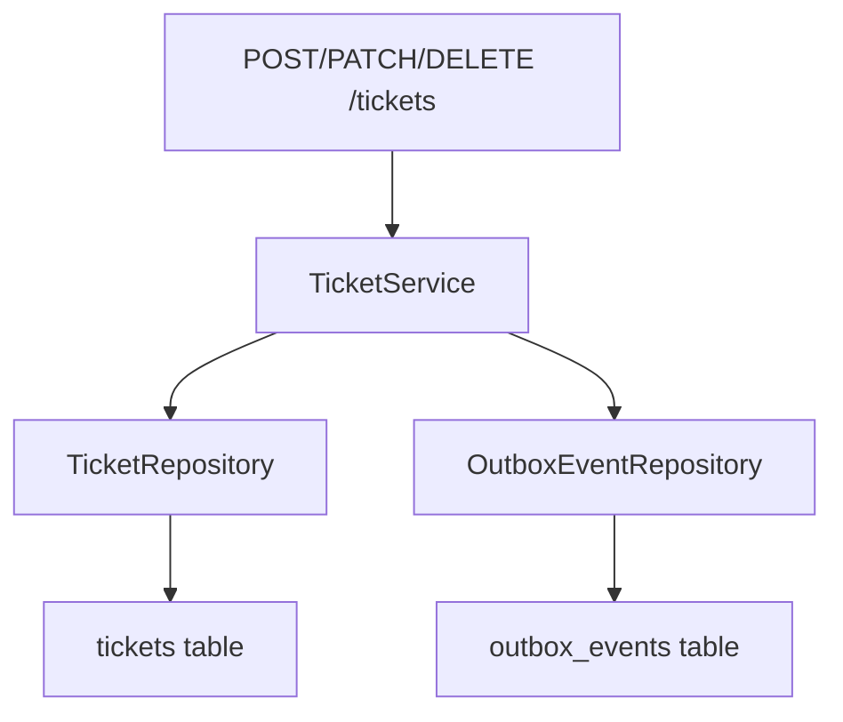
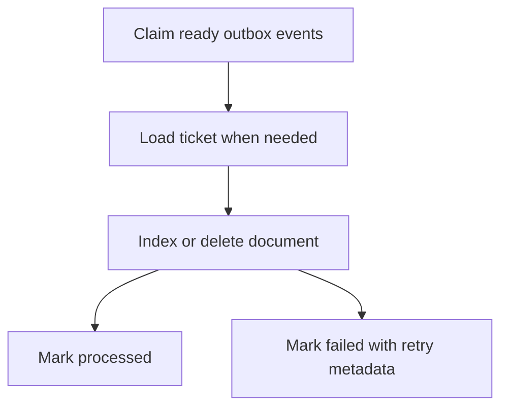
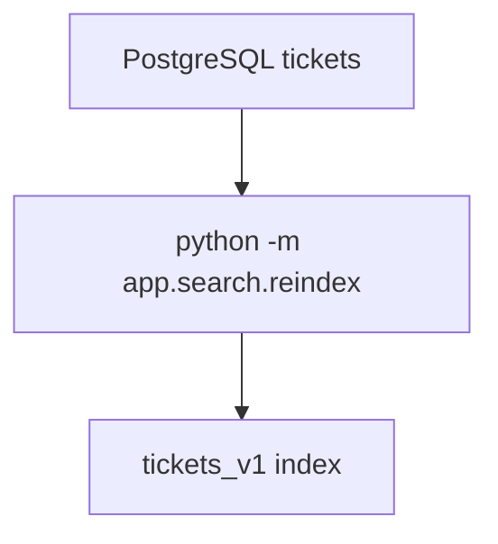
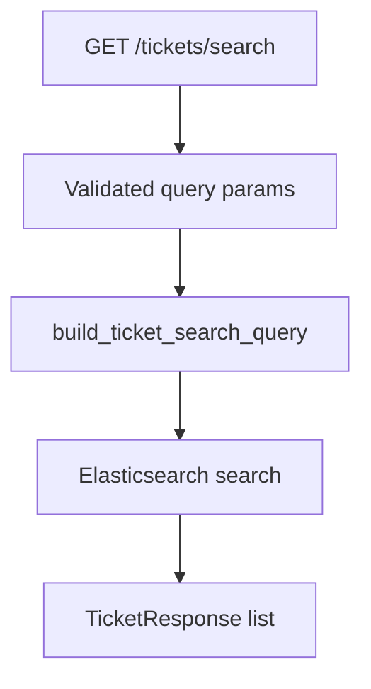

# Architecture Notes

This service is built around one boundary:

**PostgreSQL owns durable ticket state. Elasticsearch owns the search projection.**

The API never treats Elasticsearch as the system of record. Search can be temporarily stale, unavailable, or rebuilt without losing ticket data.

See [design-decisions.md](design-decisions.md) for the tradeoffs behind the major choices.

## Runtime Boundaries

| Boundary | Responsibility |
| --- | --- |
| FastAPI routes | HTTP validation, dependency wiring, response models |
| Service layer | Ticket use cases and transaction-level orchestration |
| Repositories | PostgreSQL reads and writes |
| PostgreSQL | Durable ticket data and durable outbox events |
| Outbox processor | Converts ticket events into Elasticsearch index/delete operations |
| Elasticsearch | Full-text and filter-heavy search projection |
| Reindex command | Rebuilds Elasticsearch from PostgreSQL |

## Write Path

Ticket writes and outbox events are committed together.

This means the application does not need Elasticsearch to be healthy in order to accept ticket writes.

## Incremental Search Sync

The outbox processor handles projection updates after the write transaction exists in PostgreSQL.

The processor stores retry state in PostgreSQL:

- `status`
- `retry_count`
- `last_error`
- `next_attempt_at`
- `processed_at`

That keeps failure handling visible and testable.

## Full Rebuild

The reindex command is the recovery path for a missing or stale search projection.

Reindexing is useful when:

- the Elasticsearch index is recreated
- the mapping changes
- local development data is reset
- projection state is suspected to be stale

## Search Path

Search requests use a dedicated query builder before touching Elasticsearch.

Keeping query construction outside the route makes the behavior easy to unit test without a live Elasticsearch service.

## Health Model

The API exposes two health endpoints with different meanings:

| Endpoint | Meaning |
| --- | --- |
| `/health` | The API process is alive |
| `/health/search` | Elasticsearch is reachable and the configured ticket index exists |

This separation prevents a search outage from being confused with a total API outage.

## Failure and Recovery Model

| Failure | Expected behavior | Recovery path |
| --- | --- | --- |
| Elasticsearch is down during a ticket write | The PostgreSQL write can still succeed | The outbox event remains durable and can be retried |
| Outbox processing fails | The event is marked `failed` with retry metadata | Retry after `next_attempt_at` |
| Elasticsearch index is missing | `/health/search` reports a non-OK state | Run `python -m app.search.setup` |
| Search projection is stale or corrupted | PostgreSQL remains authoritative | Run `python -m app.search.reindex` |
| API process is alive but search is unavailable | `/health` stays separate from `/health/search` | Diagnose search dependency without masking API liveness |

The system favors explicit recovery over pretending the two stores are always perfectly synchronized.

## Consistency Model

The write side is strongly consistent inside PostgreSQL: ticket rows and outbox events are committed in the same transaction.

The search side is eventually consistent: Elasticsearch may lag behind PostgreSQL until the outbox processor syncs events or a reindex rebuilds the projection.

This is an intentional tradeoff. It keeps the ticket write path durable and avoids coupling user-facing writes to Elasticsearch availability.
